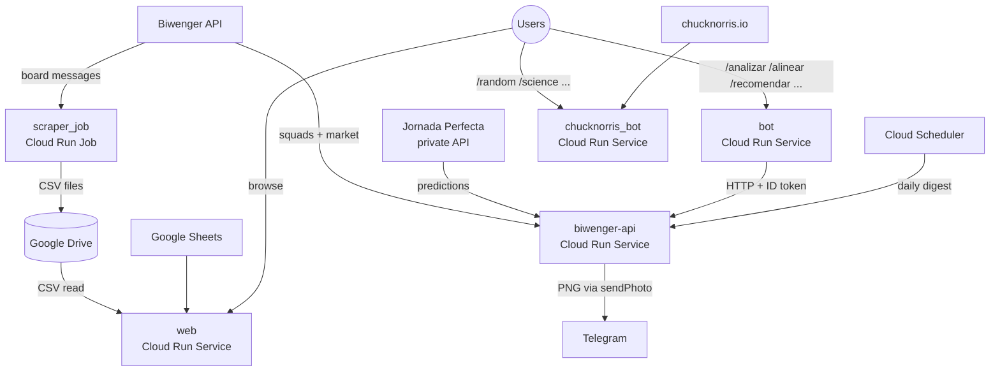

# lillorepo

Python monorepo targeting Google Cloud Platform. Hosts **Biwenger Tools** (fantasy-football league analytics) and **Chuck Norris Bot** (resurrected 2015 side project, now in the same infra).

## Architecture



## Packages

| Package | Description | Deployment |
|---------|-------------|------------|
| `biwenger_tools/web` | Flask analytics dashboard | Cloud Run Service |
| `biwenger_tools/scraper_job` | League board scraper → CSV → Drive | Cloud Run Job (weekly cron) |
| `biwenger_tools/api` | Biwenger business logic over HTTP: `/teams`, `/lineups/auto-pick`, `/budget/recommendations`, `/digests/daily`, etc. Renders PNG, sends to Telegram. | Cloud Run Service (`--no-allow-unauthenticated`) |
| `biwenger_tools/bot` | Webhook handler for `/analizar`, `/myteam`, `/mercado`, `/alinear`, `/recomendar`, `/help` — calls the api with an ID token | Cloud Run Service |
| `chucknorris_bot` | Webhook handler that fetches jokes from chucknorris.io | Cloud Run Service |

## Repository Structure

```
/core           Shared library: Biwenger SDK, JP SDK, GCP, Telegram, domain models
/packages       Self-contained services (one subdirectory per package)
/docker         Pre-built Python base image (all deps pre-installed)
/tools          Custom Bazel macros (python_service)
/platforms      Platform definitions (linux/amd64, linux/arm64)
/scripts        GCP cost monitoring and Artifact Registry cleanup
/docs           Operations runbook, setup guides, technical audit notes
```

## Build System

Built with [Bazel](https://bazel.build/) (bzlmod). All Python dependencies are pinned with hashes in `requirements_lock.txt`.

```bash
# Build everything
bazel build //...

# Run all tests
bazel test //... --test_output=streamed

# Run web app locally (Flask dev server)
bazel run //packages/biwenger_tools/web:web_local

# Deploy web to Cloud Run
bazel run //packages/biwenger_tools/web:push_image_to_gcp --platforms=//platforms:linux_amd64
cd packages/biwenger_tools/web/ && ./deploy.sh
```

See [`docs/operations.md`](docs/operations.md) for the full command reference.

## Stack

| Layer | Technology |
|-------|-----------|
| Build | Bazel 9.1 (bzlmod), rules_python, rules_oci, rules_pkg |
| Language | Python 3.13 |
| Web | Flask + Gunicorn |
| Cloud | GCP — Cloud Run Services, Cloud Run Jobs, Secret Manager, Artifact Registry, Cloud Scheduler |
| Storage | Google Drive (CSV data lake), Google Sheets (config data) |
| CI/CD | GitHub Actions |

## Core Library

`//core` exposes granular Bazel targets — use the specific target to avoid pulling in unneeded deps:

| Target | Contains |
|--------|----------|
| `//core:gcp` | Drive, Sheets, file status helpers |
| `//core:telegram` | Telegram Bot API client + webhook helpers (parse, secret validation) |
| `//core:biwenger` | Biwenger API client (URL constants, paginators) |
| `//core:jp` | Jornada Perfecta private API client |
| `//core` | Umbrella — all of the above + shared constants (`MADRID_TZ`, `LEAGUE_ID`, `DRIVE_STALE_THRESHOLD`) |
| `//core:core_srcs` | Tar of sources for Docker layers |

Domain models (`LeagueMessage`, `Participation`, `Clausulazo`, `JusticeEntry`) define the CSV contracts between services and live in `core/domain/`.

## Deployment

CI/CD runs on every push to `master`. Per-service `paths-filter` only deploys what changed (`core/`, `tools/`, `docker/`, `MODULE.bazel` or the package itself triggers that service):

1. **Lint** — flake8 + `black --check` on `core/` and `packages/` (see [`docs/setup/linter.md`](docs/setup/linter.md))
2. **Test** — runs all test suites in parallel (gated on lint passing)
3. **Deploy** (selective, in parallel):
   - **web** → `biwenger-summary` Cloud Run Service
   - **scraper_job** → `biwenger-scraper-data` Cloud Run Job
   - **api** → `biwenger-api` Cloud Run Service
   - **bot** → `biwenger-bot` Cloud Run Service
   - **chucknorris_bot** → `chucknorris-bot` Cloud Run Service
4. **Cleanup** — removes old images from Artifact Registry (keeps the digest currently tagged `latest` for each repo)
