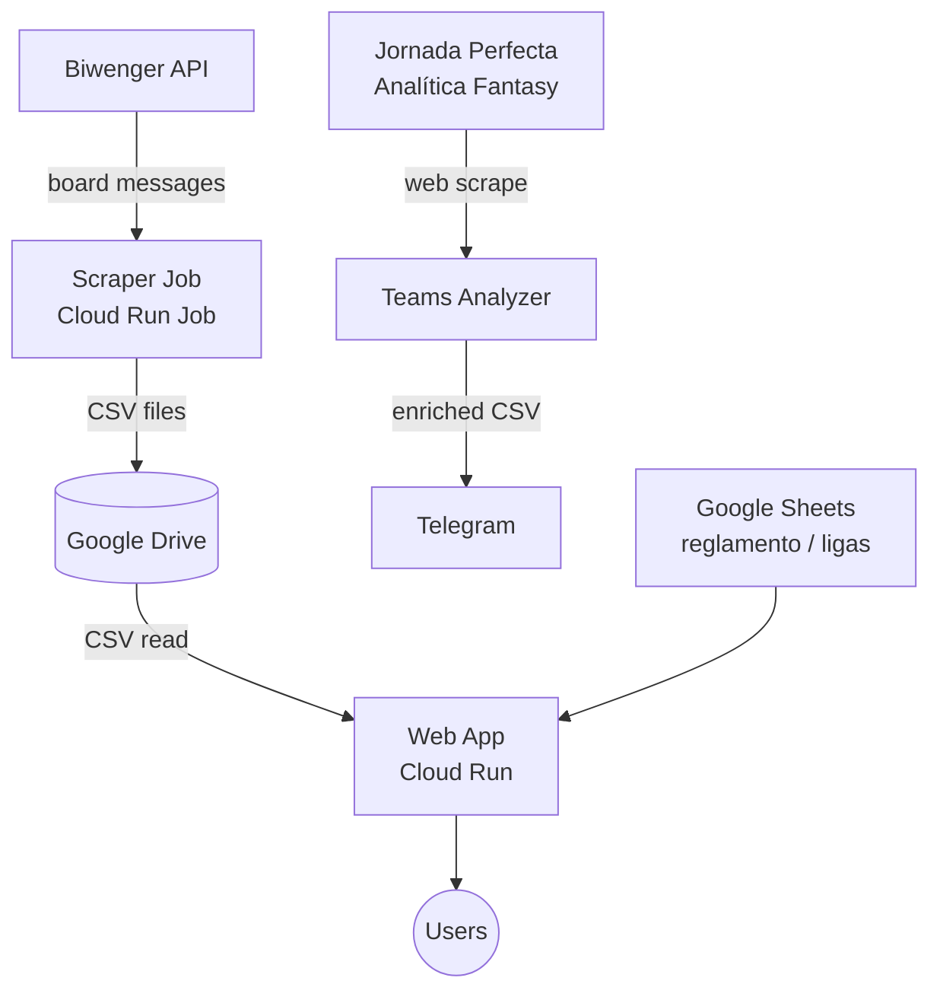

# lillorepo

Python monorepo targeting Google Cloud Platform. Currently hosts **Biwenger Tools** — a suite of services for a fantasy football league analytics platform.

## Architecture



## Packages

| Package | Description | Deployment |
|---------|-------------|------------|
| `biwenger_tools/web` | Flask analytics dashboard | Cloud Run (continuous) |
| `biwenger_tools/scraper_job` | League board scraper → CSV → Drive | Cloud Run Job (cron) |
| `biwenger_tools/teams_analyzer` | Team enrichment via web scraping | Local / Docker |

## Repository Structure

```
/core           Shared library: Biwenger SDK, GCP, Telegram, domain models
/packages       Self-contained services (one subdirectory per package)
/docker         Pre-built Python base image (all deps pre-installed)
/tools          Custom Bazel macros (python_service)
/platforms      Platform definitions (linux/amd64, linux/arm64)
/scripts        GCP cost monitoring and Artifact Registry cleanup
/docs           Operations runbook and technical audit notes
```

## Build System

Built with [Bazel](https://bazel.build/) (bzlmod). All Python dependencies are pinned with hashes in `requirements_lock.txt`.

```bash
# Build everything
bazel build //...

# Run all tests
bazel test //... --test_output=streamed

# Run web app locally (Flask dev server)
bazel run //packages/biwenger_tools/web:web_local

# Deploy web to Cloud Run
bazel run //packages/biwenger_tools/web:push_image_to_gcp --platforms=//platforms:linux_amd64
cd packages/biwenger_tools/web/ && ./deploy.sh
```

See [`docs/operations.md`](docs/operations.md) for the full command reference.

## Stack

| Layer | Technology |
|-------|-----------|
| Build | Bazel 9.1 (bzlmod), rules_python, rules_oci, rules_pkg |
| Language | Python 3.12 |
| Web | Flask + Gunicorn |
| Cloud | GCP — Cloud Run, Cloud Run Jobs, Secret Manager, Artifact Registry |
| Storage | Google Drive (CSV data lake), Google Sheets (config data) |
| CI/CD | GitHub Actions |

## Core Library

`//core` exposes granular Bazel targets — use the specific target to avoid pulling in unneeded deps:

| Target | Contains |
|--------|----------|
| `//core:gcp` | Drive, Sheets, file status helpers |
| `//core:telegram` | Telegram Bot API client |
| `//core:biwenger` | Biwenger API client |
| `//core` | Umbrella — all of the above |
| `//core:core_srcs` | Tar of sources for Docker layers |

Domain models (`LeagueMessage`, `Participation`, `Clausulazo`, `JusticeEntry`) define the CSV contracts between services and live in `core/domain/`.

## Deployment

CI/CD runs on every push to `master`:

1. **Test** — runs all test suites in parallel
2. **Deploy web** — builds OCI image → pushes to Artifact Registry → deploys to Cloud Run
3. **Deploy scraper** — builds OCI image → pushes → updates Cloud Run Job
4. **Cleanup** — removes old images from Artifact Registry (keeps `latest`)
