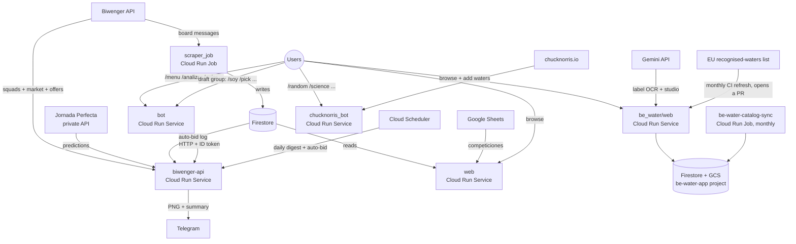

# lillorepo

Python monorepo targeting Google Cloud Platform. Hosts **Biwenger Tools** (fantasy-football league analytics), **Be Water** (open catalog of Spanish bottled waters, on its own GCP project) and **Chuck Norris Bot** (resurrected 2015 side project, now in the same infra).

> See [`STATUS.md`](STATUS.md) for the living maturity score, the full capability inventory and the multi-product state of the repo.

## Architecture


```mermaid
graph TD
    BWAPI[Biwenger API] -->|board messages| SJ[scraper_job<br/>Cloud Run Job]
    BWAPI -->|squads + market + offers| API[biwenger-api<br/>Cloud Run Service]
    JP[Jornada Perfecta<br/>private API] -->|predictions| API
    SJ -->|writes| FS[(Firestore)]
    FS -->|reads| WEB[web<br/>Cloud Run Service]
    FS -->|auto-bid log| API
    API -->|PNG + summary| TG[Telegram]
    USR((Users)) -->|/menu /analizar /pujar ...| BOT[bot<br/>Cloud Run Service]
    USR -->|draft group: /soy /pick ...| BOT
    BOT -->|HTTP + ID token| API
    SCH[Cloud Scheduler] -->|daily digest + auto-bid| API
    USR -->|/random /science ...| CBOT[chucknorris_bot<br/>Cloud Run Service]
    CN[chucknorris.io] --> CBOT
    USR -->|browse + add waters| BW[be_water/web<br/>Cloud Run Service]
    BW --> BWFS[(Firestore + GCS<br/>be-water-app project)]
    GEM[Gemini API] -->|label OCR + studio| BW
    BWSYNC[be-water-catalog-sync<br/>Cloud Run Job, monthly] --> BWFS
    EUL[EU recognised-waters list] -->|monthly CI refresh, opens a PR| BW
    GS[Google Sheets] -->|competiciones| WEB
    USR -->|browse| WEB
```

## Packages

| Package | Description | Deployment |
|---------|-------------|------------|
| `biwenger_tools/web` | Flask analytics dashboard | Cloud Run Service |
| `biwenger_tools/scraper_job` | League board scraper → Firestore (deterministic doc IDs, idempotent) | Cloud Run Job (weekly cron) |
| `biwenger_tools/api` | Biwenger business logic over HTTP: `/teams`, `/lineups/auto-pick`, `/budget/recommendations`, `/digests/daily`, `/managers`, `/draft/*` (annual snake draft), etc. Renders PNG, sends to Telegram. | Cloud Run Service (`--no-allow-unauthenticated`) |
| `biwenger_tools/bot` | Webhook handler for `/menu`, `/analizar`, `/mercado`, `/alinear`, `/preview`, `/recomendar`, `/comparar`, `/pujar`, `/ofertas`, `/emergencia`, `/scrapper`, `/version`, `/help` plus inline-keyboard callbacks — calls the api with an ID token. Also arbitrates the annual draft (`/soy`, `/pick`, `/estado`, `/deshacer`, `/exportar`) from a separate Telegram group. | Cloud Run Service |
| `chucknorris_bot` | Webhook handler that fetches jokes from chucknorris.io | Cloud Run Service |
| `be_water/web` | Open catalog of Spanish bottled waters: composition, provenance, similarity recommender, photo adds with Gemini label OCR, community ranking + achievements | Cloud Run Service (own GCP project `be-water-app`) |

## A note on `packages/emulation_thor6`

That package is **documentation for organising a personal retro-game
collection**: setup notes, a folder layout and checklists, plus a script that
copies files from the owner's own disk onto an SD card.

It contains **no ROMs, no disc images, no BIOS dumps, no encryption keys and
no copyrighted game data**, it links to none, and it does not say where to
obtain any. The directories in it are empty and gitignored — they describe
where a file would go, and `.gitkeep` is the only thing committed inside them.
This is verifiable in one command:

```bash
git ls-files packages/emulation_thor6/   # Markdown, two scripts, .gitkeep
```

Its [README](packages/emulation_thor6/README.md) says the same at more length.

## Repository Structure

```
/core           Shared library: Biwenger SDK, JP SDK, GCP, Telegram, domain models
/packages       Self-contained projects, one per subdirectory. Most are
                deployed services (table above); a few — my_photos,
                emulation_thor6 — are personal projects with no code to ship
/docker         Pre-built Python base image (all deps pre-installed)
/tools          Custom Bazel macros (python_service, python_job)
/platforms      Platform definitions (linux/amd64, linux/arm64)
/scripts        CI guards (dependency-layer sync, test selection), GCP cost and cleanup
/docs           Operations runbook, setup guides, technical audit notes
```

## Build System

Built with [Bazel](https://bazel.build/) (bzlmod). All Python dependencies are pinned with hashes in `requirements_lock.txt`.

```bash
# Build everything
bazel build //...

# Run all tests
bazel test //... --test_output=streamed

# Run web app locally (Flask dev server)
bazel run //packages/biwenger_tools/web:web_local

# Deploy web to Cloud Run
bazel run //packages/biwenger_tools/web:push_image_to_gcp --platforms=//platforms:linux_amd64
cd packages/biwenger_tools/web/ && ./deploy.sh
```

See [`docs/operations.md`](docs/operations.md) for repo-wide workflows, and each
package's `OPERATIONS.md` (e.g. [`packages/biwenger_tools/OPERATIONS.md`](packages/biwenger_tools/OPERATIONS.md))
for its build/test/deploy commands.

## Stack

| Layer | Technology |
|-------|-----------|
| Build | Bazel 9.1 (bzlmod), rules_python, rules_oci, rules_pkg |
| Language | Python 3.13 |
| Web | Flask + Gunicorn |
| Cloud | GCP — Cloud Run Services, Cloud Run Jobs, Secret Manager, Artifact Registry, Cloud Scheduler |
| Storage | Firestore (native, regional `europe-southwest1`), Google Sheets (competiciones) |
| CI/CD | GitHub Actions |

## Core Library

`//core` exposes granular Bazel targets. **Every service and job passes `core_deps`** and links only the slices its imports name:

```starlark
service(main = "app.py", core_deps = ["//core:serving", "//core:telegram"])
```

The macro still defaults to the `//core` umbrella when `core_deps` is omitted, so a new package builds without it — but do not leave it out. While nothing passed it, every file in `core/` reached every package: a one-line edit to Biwenger's API client ran 10 of the 13 test suites, including a bot that has never heard of Biwenger. Omitting a slice a package needs fails in the Bazel sandbox, loudly, which is the cheap direction to be wrong in.

This scopes the **build graph**, not the image: `docker/Dockerfile.base` pip-installs every dependency regardless, so narrowing `core_deps` does not make a container smaller. Nor does it shrink `core_srcs.tar`, which ships all of `core/` unconditionally. A size win needs two more things that do not exist yet — that base image generated from the lock (see `PENDING.md`) **and** a per-service base, since today all six images share one.

| Target | Contains |
|--------|----------|
| `//core:biwenger` | Biwenger API client (URL constants, paginators, market offers) |
| `//core:domain` | Domain models — `LeagueMessage`, `Participation`, `Clausulazo`, `JusticeEntry`, `Palmares` |
| `//core:firestore` | Thin Firestore CRUD helpers (get/set/list/query/count/batch_write/delete_collection) |
| `//core:gcp` | Sheets API + Cloud Run Jobs trigger helpers + GCS object upload/download |
| `//core:gemini` | Gemini client behind the label OCR |
| `//core:http` | `retry_http_request` — the shared retry/backoff wrapper |
| `//core:jp` | Jornada Perfecta private API client (in-process cache + freshness probe) |
| `//core:oraculo` | Analítica Fantasy's Oráculo reader (API + RSC payload) |
| `//core:serving` | Gunicorn production runner |
| `//core:telegram` | Telegram Bot API client + webhook helpers (parse, secret validation) |
| `//core:web` | Flask helpers — CSRF, rate limiting, proxy trust |
| `//core` | Umbrella — all of the above |
| `//core:core_srcs` | Tar of sources for Docker layers |

Every slice also carries `core/utils.py` and `core/constants.py` (`MADRID_TZ`), which are small and genuinely cross-package. `LEAGUE_ID` is **not** among them — league-specific values live in `packages/biwenger_tools/constants.py`, because anything in that shared base reaches every package that links any slice at all.

Domain models live in `core/domain/` with symmetric `from_firestore` / `to_firestore` methods. They are a slice of their own rather than part of that shared base: they are read by `biwenger_tools` alone, and while they sat in the base a `Clausulazo` edit rebuilt and re-tested the Chuck Norris bot.

## Deployment

CI/CD runs on every push to `master`. Per-service `paths-filter` only deploys what changed (`core/`, `tools/`, `docker/`, `MODULE.bazel` or the package itself triggers that service):

1. **Lint** — flake8 + `black --check` on `core/` and `packages/` (see [`docs/setup/linter.md`](docs/setup/linter.md))
2. **Test** — runs all test suites in parallel (gated on lint passing)
3. **Deploy** (selective, in parallel):
   - **web** → `biwenger-summary` Cloud Run Service
   - **scraper_job** → `biwenger-scraper-data` Cloud Run Job
   - **api** → `biwenger-api` Cloud Run Service
   - **bot** → `biwenger-bot` Cloud Run Service
   - **chucknorris_bot** → `chucknorris-bot` Cloud Run Service
   - **be_water/web** → `be-water` Cloud Run Service (cross-project deploy to `be-water-app`)
4. **Cleanup** — removes old images from Artifact Registry (keeps the digest currently tagged `latest` for each repo)
