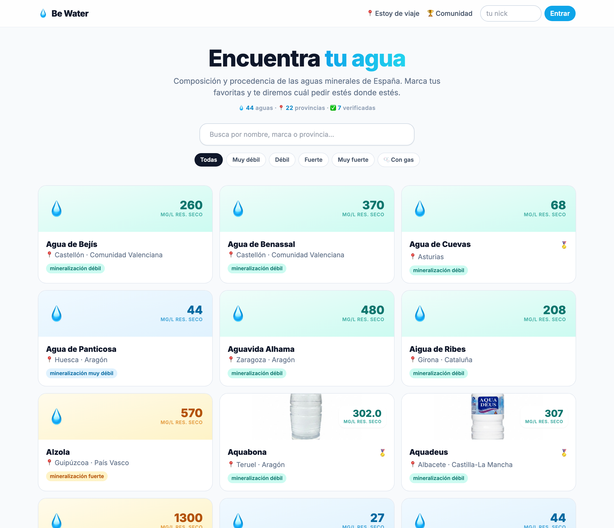
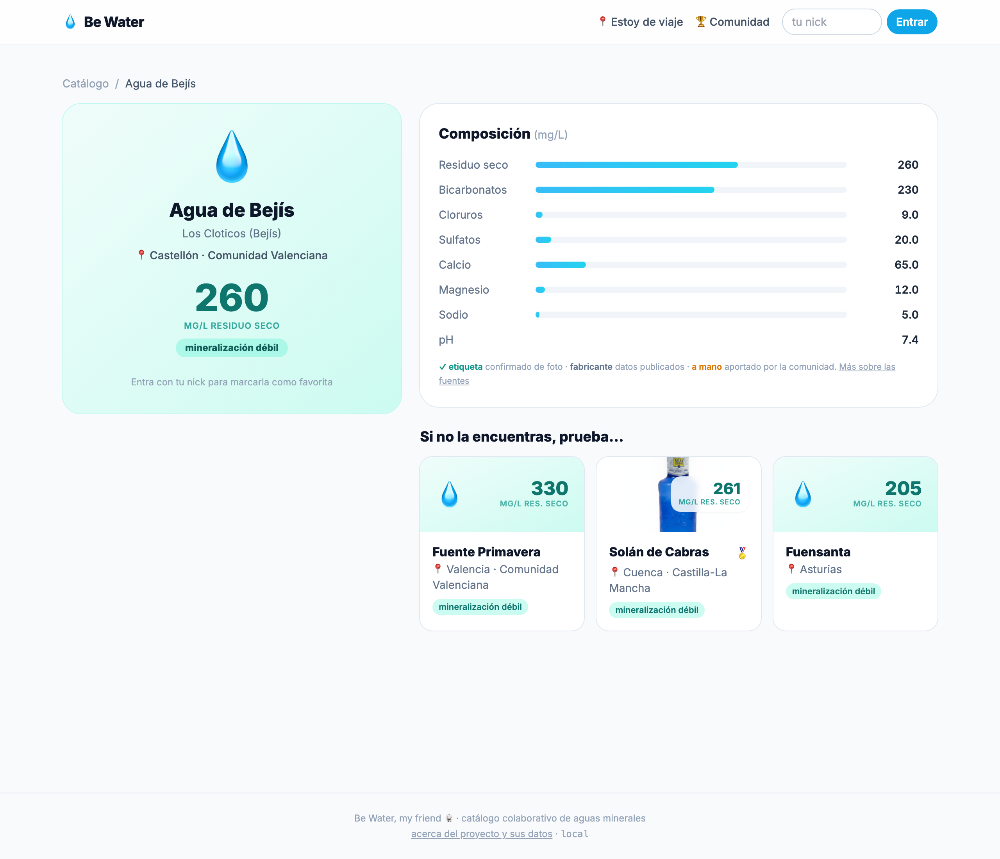
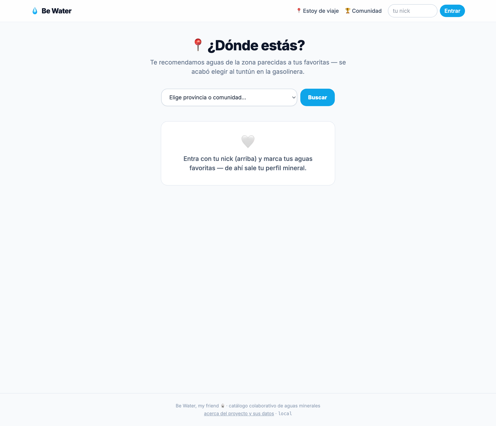
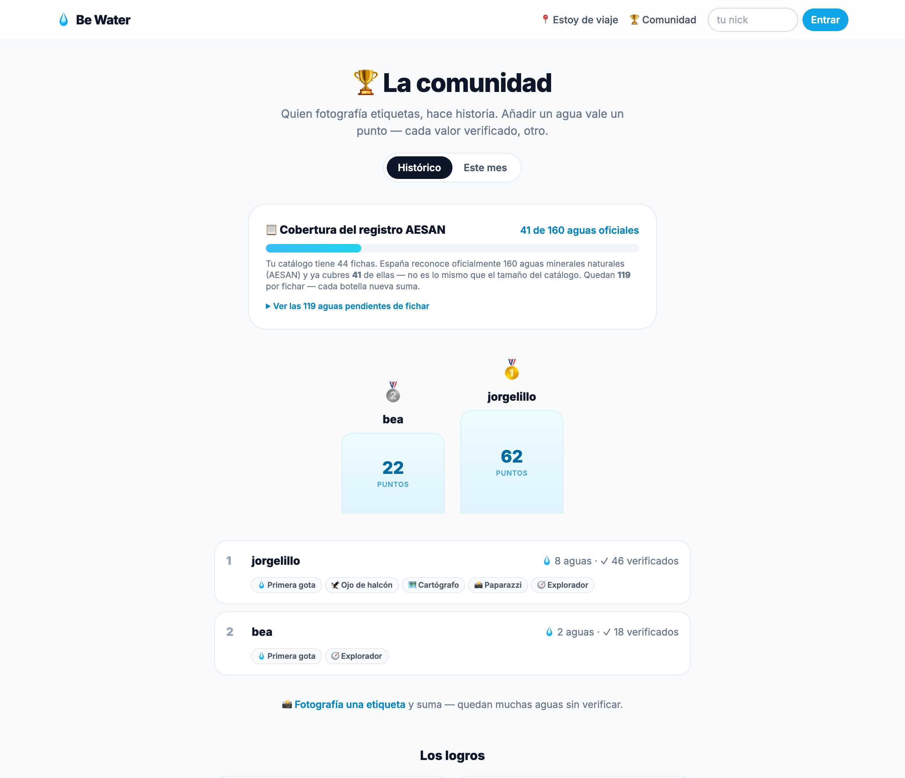
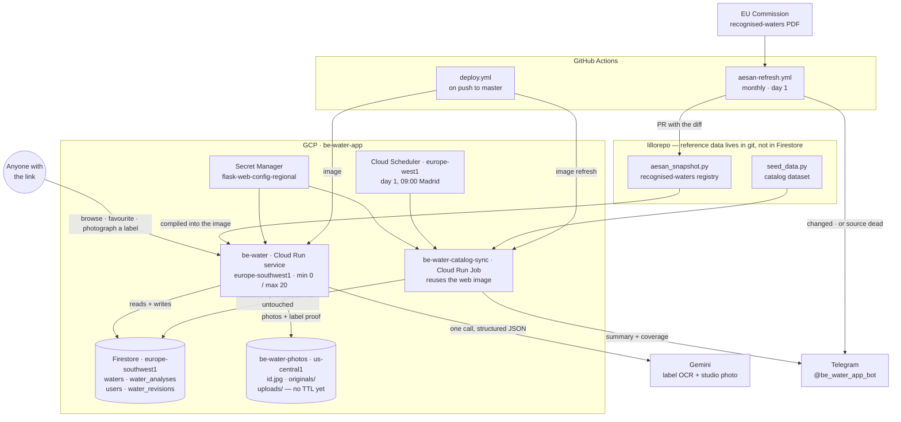
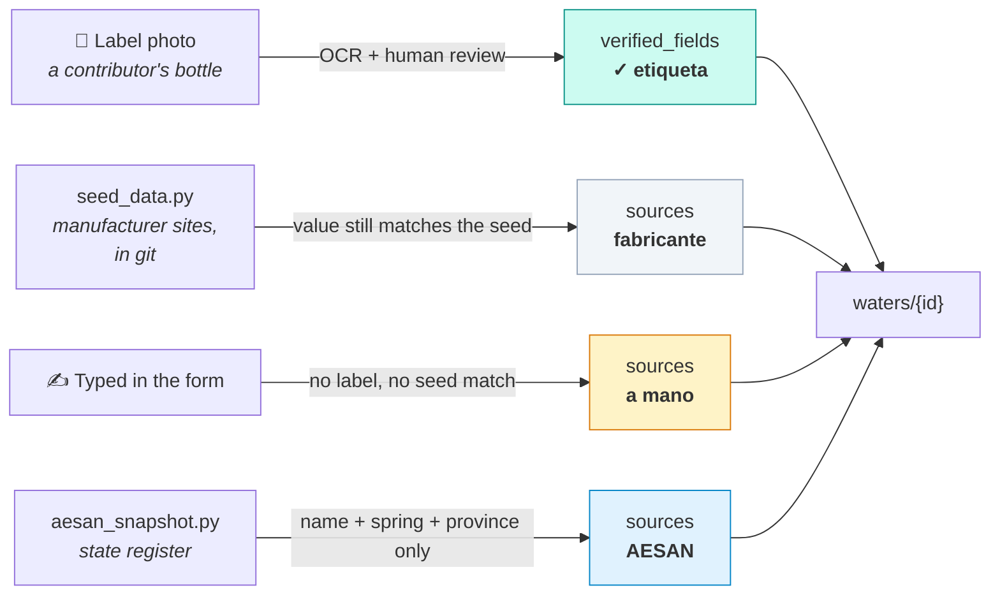

# 💧 be_water

> **Status**: **in production** since 2026-07-18 (`be-water`, GCP project
> `be-water-app`). For operational detail, see:
>
> - **What shipped**: `release-notes.md` (next to this file).
> - **Commands and runbooks** (run, tests, deploy, catalog sync, curation /
>   audit tooling): `OPERATIONS.md` (in this package).
> - **Firestore data model**: `docs/firestore.md` (root) → `be-water-app` section.
> - **Pending follow-ups**: `PENDING.md` (root) → `be_water` section.
> - **Web design system**: `web/DESIGN.md`.

## La web

| Catálogo | Ficha de un agua |
|---|---|
|  |  |
| **Recomendador** | **Comunidad** |
|  |  |

Capturas de la web en local contra los datos reales. Se regeneran a
mano — ver `web/docs/`.

A collaborative catalog of Spanish bottled mineral waters, served with Flask on
Cloud Run. Anyone with the link photographs a bottle label and the entry fills
itself in (OCR via Gemini); the catalog crosses **mineral profile × origin** to
recommend waters similar to your favorites wherever you are.

## Architecture

Two things the picture is meant to make obvious:

- **Reference data is in git, runtime data is in Firestore.** The registry
  (`aesan_snapshot.py`) and the dataset (`seed_data.py`) ship inside the image;
  what users contribute lives in Firestore. That is why a registry refresh
  arrives as a pull request you review, and why its `git diff` *is* the news.
- **Nothing overwrites a verified ficha.** The monthly sync skips them
  outright, and the add flow snapshots the previous document to
  `water_revisions` before it changes a composition
  (`scripts/revert_water.py` puts it back).

`water_revisions` is listed above but does not exist in Firestore yet — the
collection is created by the first contribution that changes an existing
composition.

## Main pieces (under `web/`)

- **App** (`app.py`) — catalog, water page, favorites, /comunidad (ranking +
  achievements), recommender, photo + OCR add flow, /acerca, /admin (dormant).
- **Data** — `domain.py` (`Water`, with **per-field provenance** in `sources`
  and `verified_fields`), `repository.py` (Firestore), `seed_data.py`,
  `aesan_snapshot.py` (official AESAN registry), `catalog_sync.py` (monthly sync).
- **Photos + AI** — `photos.py` (GCS + admin-gated *studio* treatment with
  Gemini), `label_ocr.py` (label OCR). Shared SDK in `core/sdk/gemini.py`.
- **Reusable engines** (also reused by `/admin`): `provenance.py` (derives each
  value's source), `photo_audit.py` (photo diagnosis/repair), `data_audit.py`
  (verification sign-off, duplicates, suspicious values), `similarity.py`.

## Data trust model

Every number on a ficha says where it came from. Four sources, and they are
not interchangeable — the whole point is that a reader can tell a photographed
label from a figure somebody typed.

| Source | Means | Who can produce it | Trust |
|---|---|---|---|
| **`label`** → ✓ etiqueta | Read off a photographed label, kept as proof | Any contributor with a bottle | Highest — the legal source |
| **`manufacturer`** → fabricante | Still equal to this water's value in `seed_data.py`, transcribed from brand sites | Nobody: it is the state a water ships in | Approximate; analytics move between batches and years |
| **`manual`** → a mano | Somebody typed it: no label behind it, and it does not match the seed | Any contributor | Lowest, and the only one nothing can cross-check |
| **`aesan`** | Identity cross-checked against the state register | Automatic on save | Authoritative — **for identity only** |

Two rules that fall out of the table and are easy to get wrong:

- **AESAN never supplies a composition.** The register carries name, spring and
  province and nothing else. Every mineral comes from a label or a manufacturer.
- **`manual` is a claim about a person, not a fallback.** It renders as
  *"aportado a mano por la comunidad"*, so it may not be used as the catch-all
  for "not confirmed by a label" — a seeded value that nobody has touched is
  `manufacturer`. Lunares shipped two seeded numbers credited to the
  contributor who photographed its label; that is the bug this rule exists to
  prevent.

A ficha is **verified and locked** against overwrite two ways: auto-promotion
(every declared value label-backed) or admin sign-off (a photographed label +
at least one confirmed value).

## Design decisions (the *why*)

- **Monorepo package + its own GCP project.** The code lives in lillorepo as a
  self-contained package (shares Bazel, `core/`, the `python-base` image, CI and
  PR discipline). The *runtime* runs in a separate GCP project (`be-water-app`):
  a Firestore free tier independent of the league's, attributable cost (its own
  €1 budget), and full isolation — nothing be_water does can touch the biwenger
  digest SLO. Same `deploy.yml`, different target via paths-filter + `--project`.
- **Similarity: normalized Euclidean distance in log-scale, in-memory k-NN.**
  The mineral vector is fixed (~10 dimensions), so the whole catalog fits in RAM
  and compares without vector infrastructure. Log-scale corrects the orders of
  magnitude (sodium ranges 0 to >1000 mg/L, TDS 20 to >4000): a 100 mg
  difference in TDS doesn't weigh the same as 100 mg in sodium. The
  location-based recommender reuses the engine: centroid of your favorites ×
  candidates from the area.
- **OCR via Gemini multimodal, not Cloud Vision.** One call with the photo + a
  structured schema returns the mineral vector already parsed as JSON, with no
  fragile per-label regex. A human reviews and corrects before saving; if Gemini
  fails, the form opens empty without losing the photo.
- **Lightweight "auth".** Nickname login (no password), enough for use among
  friends. Google Sign-In + /admin shipped dormant, ready to harden it when the
  group grows (runbook in `OPERATIONS.md`).

## Data sources

- [EU list of recognised natural mineral waters](https://food.ec.europa.eu/food-safety/labelling-and-nutrition/natural-mineral-waters-and-spring-water_en)
  ([PDF](https://food.ec.europa.eu/document/download/ec4fbcc0-7185-4dce-820a-27f7e2653dad_en?filename=labelling-nutrition_mineral-waters_list_eu-recognised.pdf))
  — official identity (name + spring + location) from its "recognised by
  Spain" section; basis of the in-repo snapshot. AESAN's own PDF was the
  source until the agency retired it, and
  [its page on bottled water](https://www.aesan.gob.es/seguridad-alimentaria/alimentos-especificos/aguas-envasadas)
  now points here too.
- [IGME — recognised mineral waters](https://aguasmineralesytermales.igme.es/introduccion/aguas-minerales-reconocidas)
  — geological inventory with a map viewer.
- **Real labels** (photos + Gemini) — the composition, always from the bottle.
- [mineralwaters.org](https://mineralwaters.org/) — cross-check for dubious compositions.
