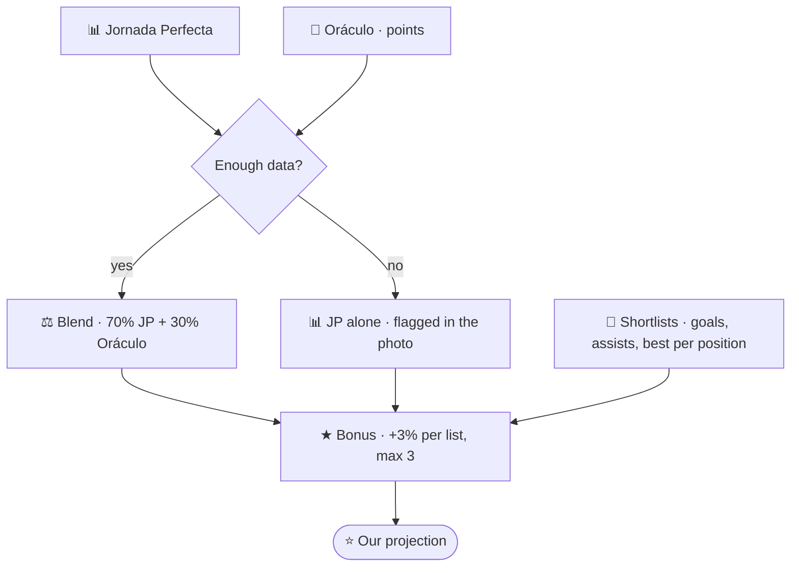

# Biwenger Tools

## Does your Biwenger league drama deserve to live forever?

Do you enjoy the banter and trash talk between friends that keeps your leagues alive? Does it annoy you when it all gets buried under ads or wiped when the season resets?

Here is the solution! This project is a **backup + web + analysis** system so your most epic messages, legendary feuds, and tactical breakdowns are preserved and accessible. And yes, it was built with more than a little help from AI ;)

---

## Packages

Four modules working together to archive, visualise and analyse data from a Biwenger league. Each one has its own README with entry point, gotchas, and local dev notes — this file is just the index.

| Package | Deployment | Detail |
|---|---|---|
| [`scraper_job/`](scraper_job/README.md) | Cloud Run Job (weekly cron) | Scrapes the league board and writes to Firestore (deterministic doc IDs, idempotent) |
| [`web/`](web/README.md) | Cloud Run Service | Flask dashboard at https://biwenger-summary-pjpqofuevq-no.a.run.app/ — reads Firestore (server-side queries + composite index) plus Sheets for `ligas_especiales` / `trofeos` |
| [`api/`](api/README.md) | Cloud Run Service | Biwenger business logic over HTTP — `/teams`, `/lineups/auto-pick`, `/budget/recommendations`, `/market/auto-bid`, `/digests/daily`, `/draft/*`, etc. Renders PNG + posts to Telegram |
| [`bot/`](bot/README.md) | Cloud Run Service | Telegram webhook → calls `api` with an OIDC ID token. Also arbitrates the annual snake draft from a separate Telegram group |

## How they fit together

```
┌────────────┐  weekly cron     ┌──────────────┐
│ scraper_job│ ────────────────▶│   Firestore  │
└────────────┘                  │  (native, EU)│
                                └──────┬───────┘
                                       │ server-side query (composite index)
                                       ▼
                               ┌───────────────┐
   browse ─────────────────────│      web      │
                               │ Cloud Run Svc │
                               └───────────────┘

                          ┌──────────────────────────────┐
                          │   api  (Cloud Run Service)   │
                          │   Flask + matplotlib         │
                          │   /teams /market /lineups    │
                          │   /budget /market/auto-bid   │
                          │   /digests/daily             │
                          └──────────────────────────────┘
                              ▲                    │
                              │ ID token           │ sendPhoto / sendMessage
                              │ (run.invoker)      ▼
                          ┌───────────┐       ┌────────────┐
   Telegram ──webhook────▶│   bot     │       │  Telegram  │
                          │ (Service) │       │            │
                          └───────────┘       └────────────┘
                              ▲
                              │ HTTPS + OIDC
                          ┌──────────────────┐
                          │ Cloud Scheduler  │ 09:00 Madrid — digest + auto-bid
                          └──────────────────┘
```

## How the projection is built

Every lineup, captain, clausulazo and bid rides on one number. Jornada Perfecta
is the base; Analítica Fantasy's Oráculo is a second opinion that nudges it.



**Everything lands in one number.** JP is the base, the Oráculo blend moves it
when there is data, and appearing on Oráculo's shortlists adds a bonus on top —
stacked, so a player on three lists gains more than one on a single list.

`chollos` is deliberately excluded from the bonus: it ranks *value*, and its
players are cheap and score less (1.1M and 4.10 points on average, against 7.0M
and 5.10 for the rest). Rewarding it in a points projection would promote cheap
players in the eleven, where price is irrelevant. It feeds bid priority instead.

**JP never stops being the base.** Oráculo can only move it, and only when
enough of the squad is covered — midweek a matchday is barely projected, so the
blend switches off and the photo says so rather than ranking three lucky
players above everyone else.

The two are not on the same scale (JP runs to ~900, Oráculo to ~10), so the
conversion calibrates itself from the median of whatever the read contains
instead of carrying a magic constant.

Detail, including why an absolute threshold was the wrong idea:
[`openspec/changes/oraculo-mix/design.md`](../../openspec/changes/oraculo-mix/design.md).

## Operational commands

See [`OPERATIONS.md`](OPERATIONS.md) for the full per-module reference (build, test, local run, deploy), plus season rollover and Firestore maintenance. Repo-wide workflows live in [`docs/operations.md`](../../docs/operations.md).

## Stack at a glance

Python 3.13 · Flask · matplotlib · BeautifulSoup · `requests` · Bazel (`@pypi`) · Cloud Run + Cloud Run Jobs + Cloud Scheduler · Secret Manager · Artifact Registry · Firestore · Google Sheets API.
