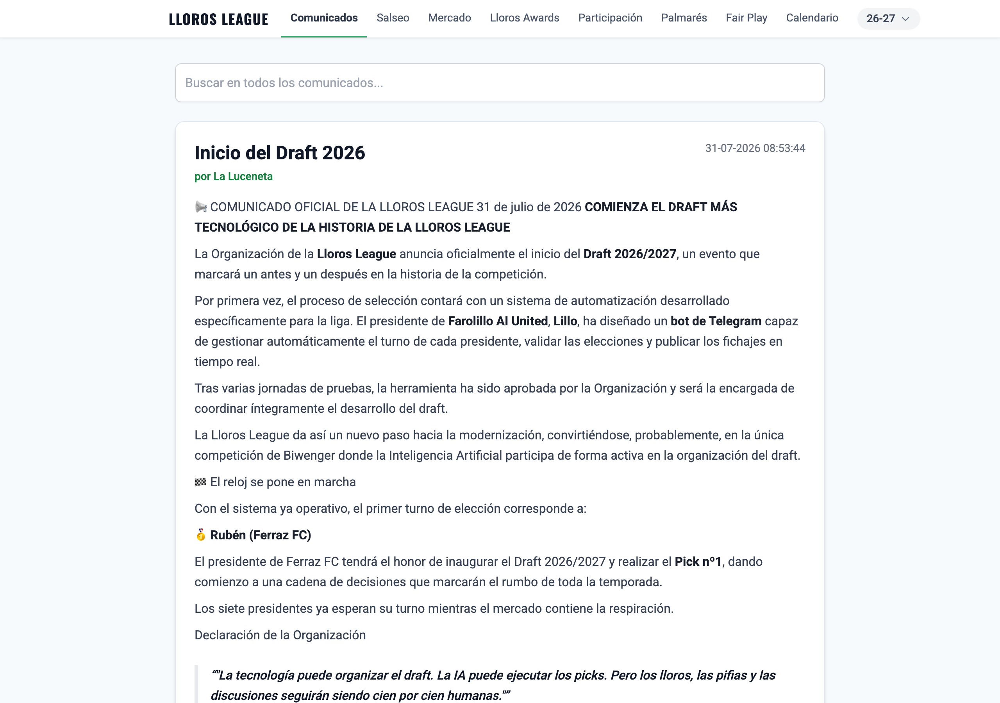
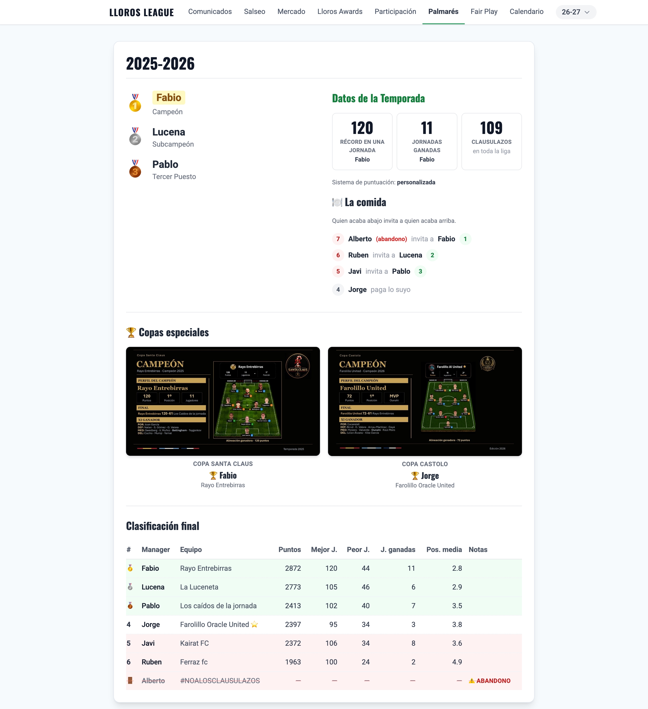
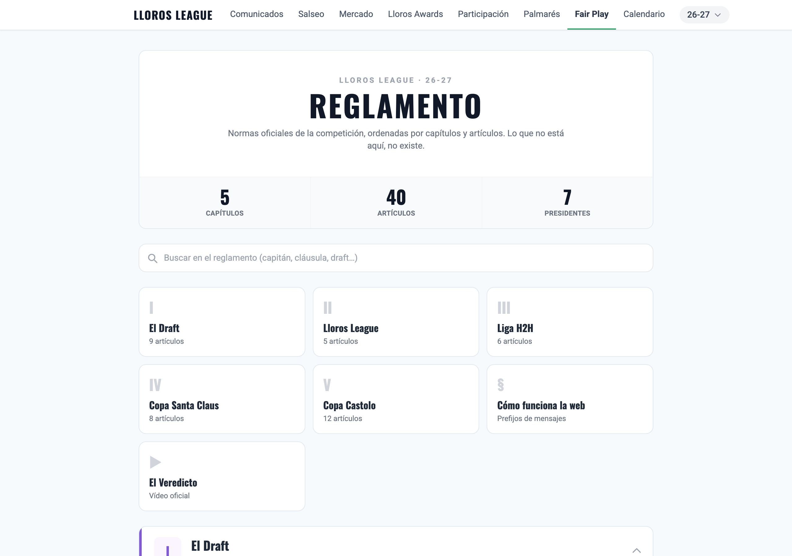
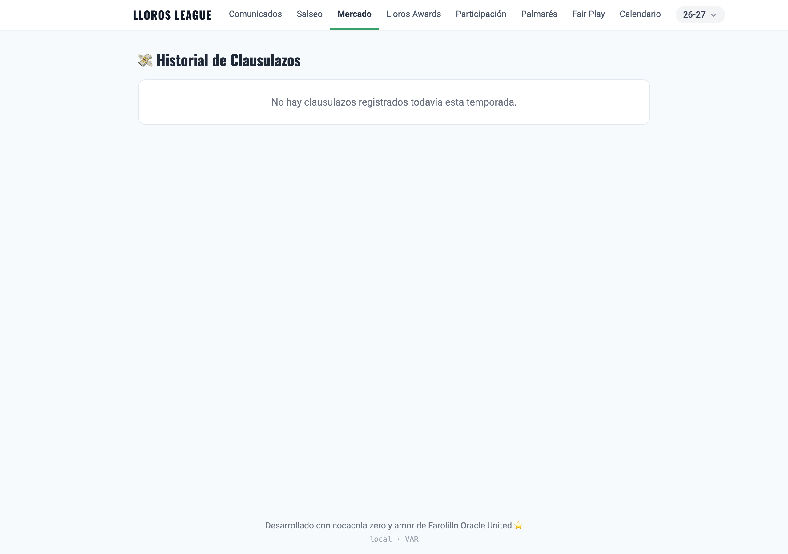

# Biwenger Tools — Web

Flask service that visualises everything the scraper has written to Firestore,
plus a small admin panel to trigger the scraper on demand.

Production URL: <https://biwenger-summary-pjpqofuevq-no.a.run.app/>

## La web

| Comunicados | Palmarés |
|---|---|
| [](docs/01-home.png) | [](docs/02-palmares.png) |
| **Reglamento** | **Mercado** |
| [](docs/03-reglamento.png) | [](docs/04-mercado.png) |

<sub>Capturas de la web corriendo en local contra los datos reales de
Firestore. Se regeneran a mano — ver `docs/` en este módulo.</sub>

## Entry point

`app.py` builds the Flask app, registers session cookie hardening + CSRF helpers,
and mounts three blueprints:

- [`routes/main.py`](routes/main.py) — `/version`, `/favicon.ico`, `/`, `/palmares`, `/reglamento`
- [`routes/season.py`](routes/season.py) — `/<season>/`, `/<season>/salseo`, `/<season>/mercado`, `/<season>/participacion`, `/<season>/lloros-awards` plus the `/api/lloros-awards/*` JSON endpoints
- [`routes/admin.py`](routes/admin.py) — `/admin` (login + dashboard), `/admin/run-scraper`, `/logout`

Data access lives in `repository.py` — typed Firestore queries (server-side
where possible, including a composite index on `messages` by
`categoria + fecha`). Sheets clients (for `ligas_especiales` / `trofeos`) are
initialised once at boot in `services.py`. HTML sanitisation (announcements
from Biwenger) lives in `sanitize.py` using `bleach` with a fixed allowlist;
never use `|safe` directly on `contenido`.

## 🎨 UI

Tailwind via CDN + vanilla JavaScript. No build step, no framework. The design
tokens (colours, typography, components) are documented in
[`DESIGN.md`](DESIGN.md) — read it before touching templates.

## ⚙️ Local dev

```bash
bazel run //packages/biwenger_tools/web:web_local
```

Needs a local `.env` with `SECRET_KEY`, `ADMIN_PASSWORD`,
`GCP_PROJECT_ID`, `CLOUD_RUN_JOB_NAME`, `CLOUD_RUN_REGION`, plus the
competitions workbooks you want to read (`COMPETICIONES_SHEET_IDS_26_27`,
comma-separated when a season spans several). For HTTP-only local dev set
`SESSION_COOKIE_SECURE=false` so the session survives without TLS.

## 🚀 Deploy

CI deploys on every push to `master` that touches `core/`, `tools/`, `docker/`,
`MODULE.bazel` or `packages/biwenger_tools/web/`. Manual deploy:

```bash
bazel run //packages/biwenger_tools/web:push_image_to_gcp --platforms=//platforms:linux_amd64
cd packages/biwenger_tools/web/ && ./deploy.sh
```

See [`OPERATIONS.md`](../OPERATIONS.md) §1 for build/test/deploy detail.
